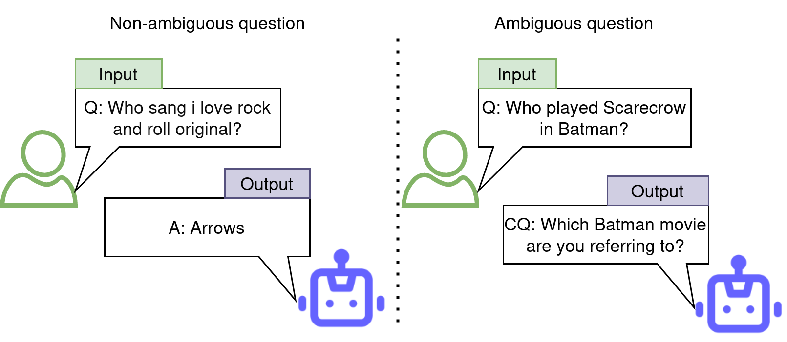
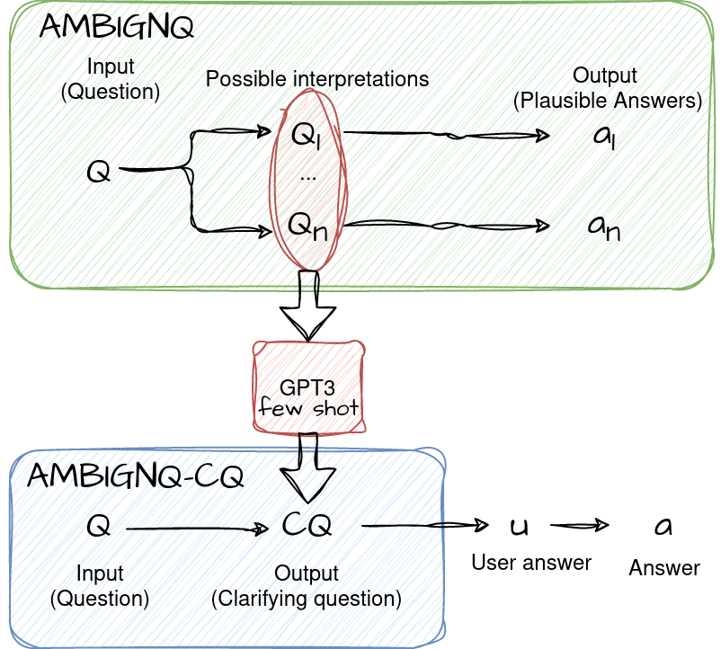
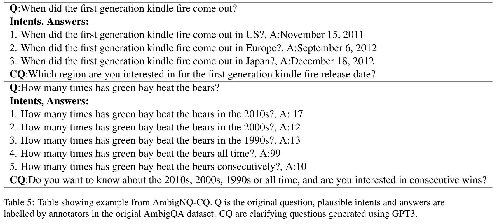

# AMBIGNQ-CQ Repository

 A proactive conversational Language Model (LLM) is essential for maintaining natural conversations and ensuring answers align with user intent. By asking clarifying questions, the LLM bridges gaps in understanding ambiguous queries, leading to more accurate responses.
 
 Asking relevant and grounded questions remains a challenge. In this paper we propose an extension of the AMBIGNQ dataset by providing relevant Clarifying questions.



## Description


The primary goal of this repository is to host the dataset introduced in the paper **Generating Grounded Clarifying Questions for Ambiguous Open-domain
Questions** . The dataset aims to provide a valuable resource for addressing the challenge of generating clarifying questions grounded to documents for ambiguous questions in the context of open-domain question answering.

This dataset aims to provide high-quality labeled examples for training LLM to have relevant pro-active behavior when faced with ambiguous questions. 

---

## Data Description

The **AMBIGNQ-CQ** dataset is an extension of the **AmbigNQ** dataset ( Min et al., 2020). AmbigNQ is a question-answering dataset explicitly designed to tackle the complexity of ambiguous questions in an open-domain setting. It builds upon the NQ-open dataset (Kwiatkowski et al., 2019) and consists of approximately 14,000 meticulously annotated examples spanning various topics.

Each example in the dataset is associated with multiple pairs of plausible interpretations along with their corresponding answers: (q1, a1), ..., (qn, an), where n ≥ 1. These interpretations are sourced from Wikipedia and offer different angles from which the question can be interpreted. The dataset classifies questions as non-ambiguous when n = 1.


Furthermore, the original dataset also provides evidence pages (Wikipedia pages that annotators used to derive the answers).

---


## Clarifying Question Generation
To construct the **AMBIGNQ-CQ** dataset, we leveraged the power of OpenAI's Davinci model using few-shot learning examples. The model's ability to understand and generate human-like text was instrumental in creating this resource.
 We fed Disambiguated Questions from AMBIGNQ and generated clarifying questions.



### Prompt
```py
prompt_intent_generation = (
	"Generate an clarifying question given multiple queries \n\n"
	"Examples:\n"
	"----------\n"
	"Query1:Who is the 4th chairman of african union commission?\n"
	"Query2:Who is the 3rd chairman of african union commission?\n"
	"Query3:Who is the 2nd chairman of african union commission?\n"
	"Question:Are you interested in 2nd, the 3rd or the 4th chairman of african union commission \n"
	"----------\n"
	"Query1:Youngest female figure skater to win olympic gold in Ladies' singles?\n"  
	"Query2:Youngest female figure skater to win olympic gold in pairs?\n"
	"Question:Do you want to know about Ladies' singles or pairs ?\n"
	"----------\n"
"Query1:Who won the most medals in the Summer Olympics?\n"
"Query2:Who won the most medals in the Winter Olympics?\n" 
	"Query3:Which country won the most medals in the Summer Olympics?\n"
	"Query4:Which country won the most medals in the Winter Olympics?\n"
	"Question:Are you looking for the most medals won by an individual or a country and in the Summer or Winter Olympics?\n"
	"----------\n"
	"Query1:How many teams are there in the afl in 1960-1965?\n"  
	"Query2:How many teams are there in the afl in 1966-1967?\n"
	"Query3:How many teams are there in the afl in 1968–1970?\n"
	"Question:Which era are you interested in for the number of teams in the AFL?\n"
	"----------\n"
	)

```


### Examples

Here's an example from the dataset:




### Evidence Passage
The AMBIGNQ dataset also includes semi-oracle evidence, which are Wikipedia pages that annotators used to extract answers. As Wikipedia pages can be excessively lengthy for transformer architectures, the AMBIGNQ-CQ version offers shorter evidence passages.
We considered semi-oracle evidence, available in AmbigQA, split into 100-words passages, and re-rank them using a cross-encoder given the question q. For re-ranking passages, we rely on the pre-trained MonoT5 (Pradeep et al., 2021).


## Citation

If you use the **AMBIGNQ-CQ** dataset in your research, please consider citing the original papers for **AmbigNQ** (Min et al., 2020) and **NQ-open** (Kwiatkowski et al., 2019).


---
